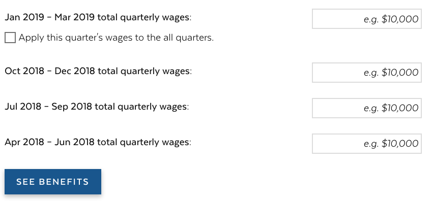
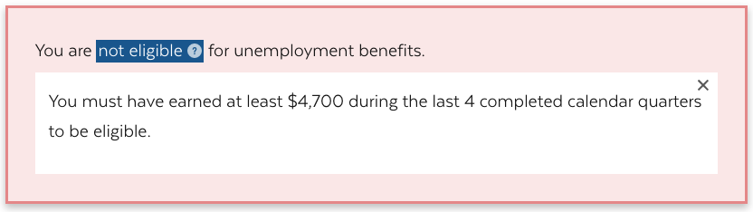
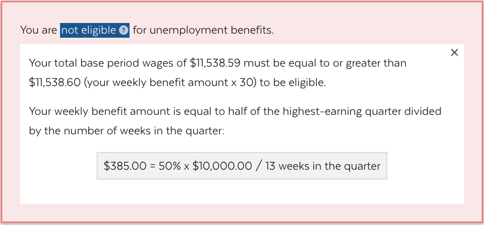
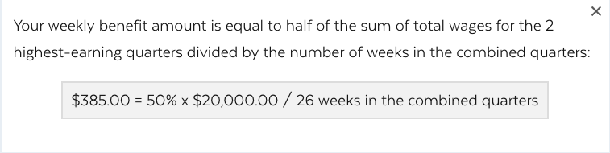
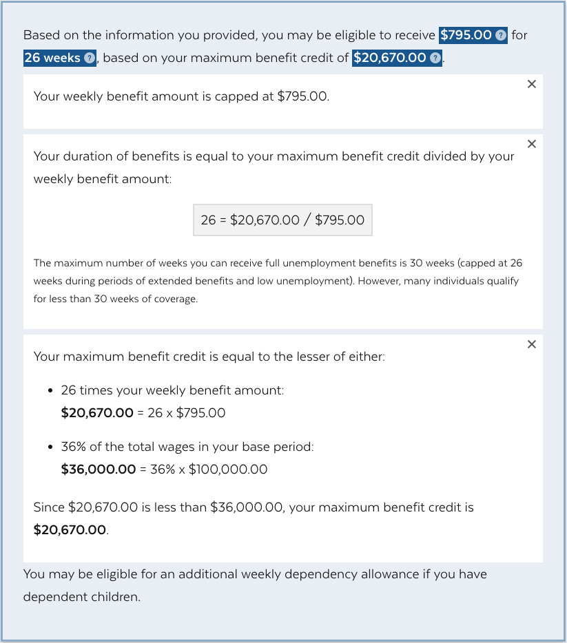
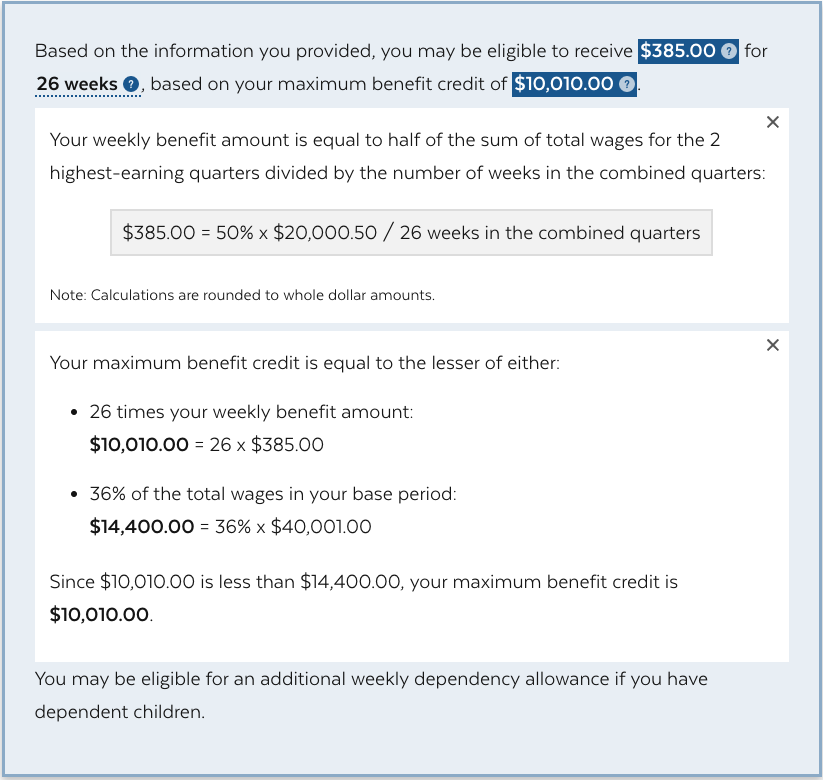
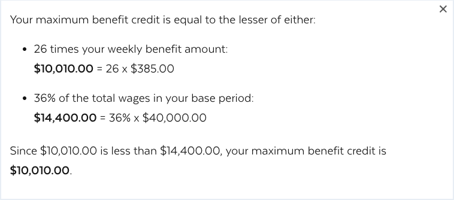
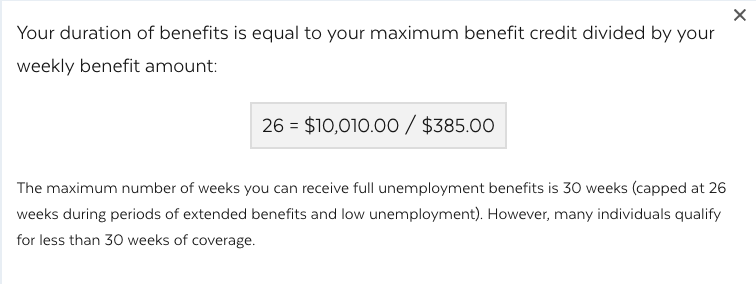

# Unemployment Benefits calculator documentation
Use this documentation to learn where the formulas live and how the calculator formula was created.
## Calculator Logic
The main logic of the calculator live in these files:
- [Variables](../src/data/variables.json)
- [Input](../src/components/Form/index.js)
- [Output](../src/components/Form/output.js)

## Variable constants
There are 4 variables that are constants. Here are their values:
```
maxBenefitDuration = 26
quartersSumThreshhold = 4700
weeklyBenefitMax = 795
maxBenefitRatio = 0.36
```

To change max benefit duration from 26 weeks to 30 weeks, change `maxBenefitDuration` in [Variables](../src/data/variables.json) to `30`.
> This variable will impact the formula of calculating the maxBenefit total and hence the benefits duration outcome.

## Input

Input consists of 4 currency input for total quarterly wages, 1 checkbox for apply first quarter wages to all and a submit button.

*Image 1: Input fields in the calculator*



### Currency input:
The labels for the 4 currency input are calculated based date ranges based on the current date.
Quarter date range calculation logic:
```
const quarterCurrent = moment().quarter();
const quarterDateRange = (quartersAgo) => {
  const quarter = quarterCurrent - quartersAgo;
  let qEnd = moment().quarter(quarter).endOf('quarter');
  let qStart = moment().quarter(quarter).startOf('quarter');
  qEnd = moment(qEnd).format(format);
  qStart = moment(qStart).format(format);
  return{ qEnd, qStart };
};
```

### Checkbox:
The apply-to-all checkbox is added for the convenience of the users inputing the same quarterly income for the last 4 quarters. Checking the box will keep the other 3 currency inputs in sync with the value in the first currency input; unchecking the box will break out of the sync and let the user edit the value in each of the other 3 currency inputs.

### Submit Button:
The submit button will take the values from the user input and render the new output below.


----
## Output

### Eligibility
There are two eligibility thresholds for the wages to meet for being qualified for unemployment benefits (See `qualification1` and `qualification2`):

#### Qualification1: Total wages is no less than the threshhold $4700

**Calculation formula**
```
  const qualification1 = !(quartersSum < quartersSumThreshhold);
```
See `quartersSumThreshhold` in [Variables](../src/data/variables.json)

**Scenario failing to meet qualification 1**
Enter `$1,000.00` in all 4 quarters

*Image 2: Scenario failing to meet qualification 1*


#### Qualification2: Total wages is no less than 30 times the weeklyBenefitFinal

**Calculation formula**
```
  const qualification2 = !(quartersSum < (30 * weeklyBenefitFinal));
```
**Scenario failing to meet qualification 2**
```
Q1: $10,000
Q2: $1,538 or anything amount that is less than $1,550
```
*Image 3: Scenario failing to meet qualification 2*



### Benefits Calculation
#### Weekly benefit amount (WBA):
WBA calculation is broken down in 4 steps:
1. Determine the top quarters based on the number of quarters that have wages out of the last 4 quarters
> - If only 2 or less quarters have wages, WBA is equal to half of the highest-earning quarter divided by the number of weeks in the quarter (13).
> - If more than 2 quarters have wages, WBA is equal to half of the sum of total wages for the 2 highest-earning quarters divided by the number of weeks in the combined quarters (26).
```
  let topQuarters;
  let weeksInTopQuarters = 26;
  if (quartersCount > 2) {
    topQuarters = quartersHaveValue.sort((q1, q2) => q2 - q1).slice(0, 2);
  } else if (quartersCount > 0) {
    topQuarters = quartersHaveValue.sort((q1, q2) => q2 - q1).slice(0, 1);
    weeksInTopQuarters = 13;
  }
  const topQuartersSum = topQuarters && topQuarters.length > 0 && topQuarters.reduce(sum);
```

2. Calculate average weekly pay (`avgWeeklyPay`) in the top quarters
```
const avgWeeklyPay = Math.ceil(topQuartersSum / weeksInTopQuarters);
```
> Average weekly pay is rounded *up* to the nearest dollar

3. Calculate weekly benefit amount (`weeklyBenefit`) based on the average weekly pay from the previous step
```
const weeklyBenefit = Math.floor(1 / 2 * avgWeeklyPay);
```
> Weekly benefit is rounded *down* to the nearest dollar amount

4. Making sure that the final weekly benefit amount (`WeeklyBenefitFinal`) never exceeds the maximum
```
const weeklyBenefitFinal = Math.min(weeklyBenefit, weeklyBenefitMax);
```
See `weeklyBenefitMax` in [Variables](../src/data/variables.json)
> WeeklyBenefitFinal is used in the calculation of the max benefits credit, benefits duration and the final display of WBA

**Scenario where weekly benefit amount does not exceed the maximum**
Enter `$10,000.00` in all 4 quarters

*Image 4: Scenario where weekly benefit amount does not exceed the maximum*


**Scenario where weekly benefit maximum is reached**
Enter `$25,000.00` in all 4 quarters

*Image 5: Scenario where weekly benefit maximum is reached*


**Scenario for inputs with cents**
Enter `$10,000.25` in all 4 quarters

*Image 6: Scenario for inputs with cents*


#### Max benefits credit calculation:
```
const maxBenefitOption1 = maxBenefitDuration * weeklyBenefitFinal;
const maxBenefitOption2 = Math.floor(maxBenefitRatio * quartersSum);
const maxBenefitFinal = Math.min(maxBenefitOption1, maxBenefitOption2);
const maxBenefitOther = Math.max(maxBenefitOption1, maxBenefitOption2);
```
> `quartersSum` will have cents when wages input contains cents, `maxBenefitOption2` is rounded *down* to the nearest dollar

e.g. Enter `$10,000.00` in all 4 quarters

*Image 7: Max benefit credit explanation display*

#### Benefits duration calculation:
```
const benefitDuration = maxBenefitFinal / weeklyBenefitFinal;
```
e.g. Enter `$10,000.00` in all 4 quarters

*Image 8: Benefits duration explanation display*

